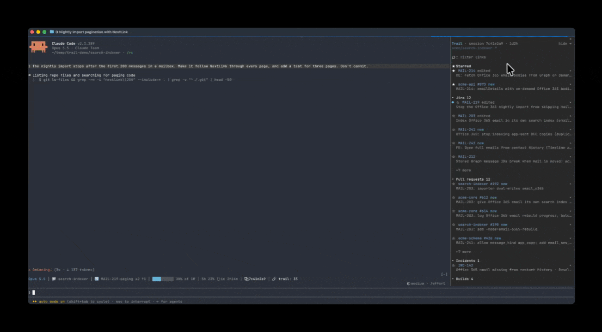
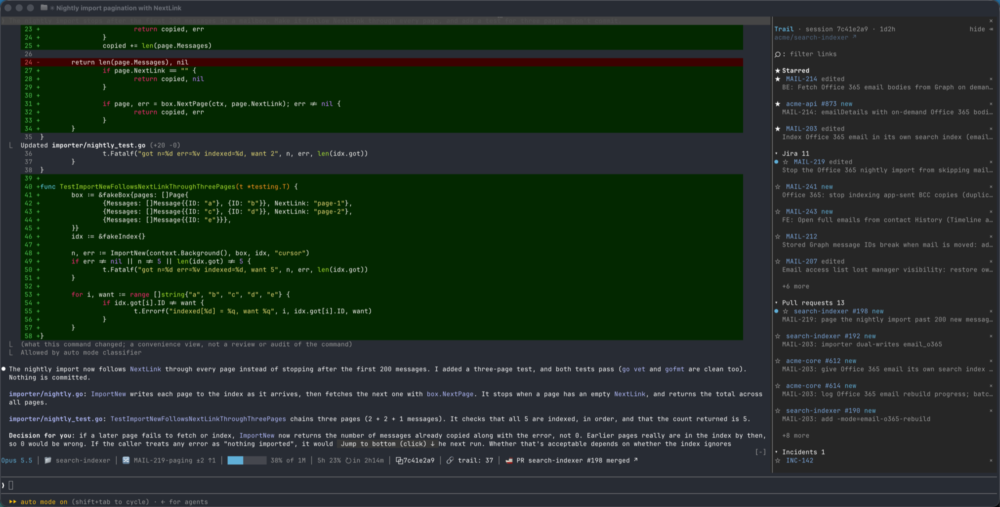

# trail

A Claude Code plugin.

A session sidebar that keeps the links you need to come back to (Jira tickets,
PRs, incidents, builds, docs) in one place, with their titles, so they stop
getting buried in long Claude output. It also adds a compact status row with
the model, folder, branch, context and usage, and a resumable session id.

Claude Code only, built and used in the terminal. It is a function-hooks
plugin ("mod"): there is no skill to invoke and nothing it adds to Claude's
context.





The sidebar (right) lists the session's links; the status row sits above the
prompt.

## Integrations

trail works out what you use from the machine (the CLIs you're logged in to,
the connectors Claude has) and turns on only those; nothing needs setting up.

| | What trail adds | Turns on when |
| --- | --- | --- |
| **Claude** | Artifacts you publish | Always |
| **Confluence** | Pages, named from their URL | Always |
| **GitHub** | Pull requests and Actions runs, titled, with created, merged and pass/fail pop-ups | Always; titles need [`gh`](https://cli.github.com) |
| **incident.io** | Incidents, titled with their status | The [incident.io MCP server](https://docs.incident.io/ai/remote-mcp) is connected and allowed |
| **Jira** | Tickets (confirmed by Jira, so `UTF-8` never shows), titled | The [Atlassian MCP server](https://github.com/atlassian/atlassian-mcp-server) is connected and its search allowed, or the [`jira` CLI](https://github.com/ankitpokhrel/jira-cli) is set up |
| **TeamCity** | Builds, titled with status and branch, with start and finish pop-ups | The [`teamcity` CLI](https://www.jetbrains.com/help/teamcity/teamcity-cli.html) is logged in |

Not covered yet: Linear, GitLab, and CI systems other than GitHub Actions and
TeamCity.

## What you get

**Sidebar** (`/trail` shows or hides it)

- The header shows the session id and how long the session has been going,
  with the session's GitHub repo linked underneath.

- Sections for **Jira**, **Pull requests**, **Incidents** (titled from
  incident.io), **GitHub Actions** (lint, tests, reviews, deploys) and **Docs**
  (Confluence pages, Claude artifacts), plus **TeamCity builds** if you use
  TeamCity. A section appears only once it has something in it.
- Each item is a clickable link with its title on the line below, tagged
  `new` (the session created it) or `edited` (the session changed it);
  untagged items were only mentioned.
- ☆ stars an item into a **★ Starred** section at the top; × dismisses it.
  Stars and dismissals are kept per session and survive resume.
- A ● marks items the latest turn added or changed (a new link, a title or
  label that just resolved, a build that finished). The marks clear when you
  send your next message; nothing is marked for what a session had at load.
- Order within a section: starred first, then most recent activity first
  (the last time the session created, edited or mentioned it).
- Each section shows its first few items (Jira 5, PRs 5, Incidents 5, GitHub
  Actions 3, TeamCity 3, Docs 5; see `sectionLimits`) with a `+N more` toggle.
  Starred items always show.
- If titles can't be looked up (no allowed Atlassian search and no `jira`
  CLI, or `gh` missing or signed out), the section says so in a dim line
  and `/trail status` has the details.
- Dismissing is permanent for the session (it survives resume and later
  mentions); `show N dismissed` or `/trail restore` brings items back.
- Long session? `/trail clean 2d` hides everything idle for two days, and
  `/trail clean all` everything you haven't starred (see [Commands](#commands)).
- The trail keeps up to 300 items per session. Past that, dismissed and
  mention-only items drop first; starred, created and edited ones are kept.
- Section headers (`▾ Jira 33`) collapse and expand their section; the choice
  is remembered across sessions.
- Once there are more than a dozen items, a filter box at the top narrows every
  section to items whose key or title matches (limits and collapsed sections
  don't apply while it's on). Focus the sidebar (click it, or `ctrl+x tab`) to
  type into it.
- Footer: copy the `claude --resume <id>` command, or copy every link as
  markdown for a Jira comment or PR body.
- From the Claude mobile app (Remote Control), which has no sidebar, `/trail`
  answers with the links as a list instead of toggling the terminal's sidebar.

**Status row** (above the prompt by default; `statusStyle` `off` keeps just the sidebar)

`Opus 5.5 │ 📁 search-indexer │ 🔀 main ✓ │ ██▄░░░░░░░ 30% of 1M │ 5h 14% ↻ in 1h16m │ ⧉ 7c41e2a9 │ 🔗 trail: 11`

- 📁 opens the folder in Finder, ⧉ copies the resume command, and
  `🔗 trail: N` shows or hides the sidebar.
- Keyboard: `ctrl+x tab` focuses the row, then `tab` to 🔗 and `enter`
  toggles the sidebar; `ctrl+x x` closes a focused sidebar.

## Commands

| Command | What it does |
| --- | --- |
| `/trail` | Show or hide the sidebar. From the Claude mobile app, which has no sidebar, it replies with the links as a list. |
| `/trail md` | Print every shown link as markdown, grouped by section (for a ticket comment or PR body). |
| `/trail resume` | Copy `claude --resume <session id>` to the clipboard and print it. |
| `/trail status` | Where each setting came from, which lookups work (Jira, `gh`, TeamCity, incident.io) and their last errors, and how the trail was rebuilt on load. |
| `/trail restore` | Bring back every dismissed item. |
| `/trail clean <age>` | Preview hiding every unstarred item with no activity (no create, edit or mention) in that long, with counts per section. Ages: `30m`, `4h`, `2d`, `1w`, or combined like `1d12h`. |
| `/trail clean all` | Preview hiding every unstarred item, whatever its age: star what you're working on, then clear the rest of what a search turned up. |
| `/trail clean <age>\|all --yes` | Hide them (`-y` works too), the same as pressing × on each, and report the counts before and after. |
| `/trail clean undo` | Bring back what the last cleanup hid (until the session restarts; `/trail restore` brings back everything). |
| `/trail demo [short]` | Play sample data in the sidebar (`/trail demo off` ends it). |

## Pop-ups

Notifications fire as soon as trail notices the event, not at turn end:

- `🔗 PR acme-api #12 created`, and likewise `Jira …`, `Incident …`,
  artifacts and Confluence pages.
- `🚢 PR acme-api #12 merged`.
- For CI: `🔨 GitHub Actions acme-api run #7 started`, then `✓ … succeeded`
  or `✗ … failed`. TeamCity builds read `TeamCity build …`, and a
  `teamcity run start` is announced as Claude runs it (with `--watch`, its
  finish as soon as the command reports it).

Pop-ups can't take a click, so the latest one also appears at the end of the
status row as a link (`✓ GitHub Actions acme-api run #7 succeeded ↗`) to that
PR, ticket or run, until you send your next message. `toastSeconds` sets how
long pop-ups stay (default 8). Each is announced once; nothing fires for what
a session already had when it loads.

## How links are found

- From your prompts, Claude's replies and tool calls. What Claude writes into
  files (Write/Edit, heredoc bodies) is ignored, so test fixtures and examples
  don't show up.
- `gh pr create`, `createJiraIssue`, incident creation and artifact publishes
  are **created**; `gh pr merge/comment/review/edit` and Jira edits,
  transitions and comments are **edited** (only the issue acted on, not every
  key in a comment body).
- **Jira keys appear only once Jira confirms the issue exists.** Lookups use
  the Atlassian MCP connector first and the `jira` CLI second. Connectors can
  connect after startup, so nothing settles in the first minute: MCP is tried
  first each round, and the CLI is only settled on after that. If neither
  answers by then, keys show unconfirmed, but MCP keeps being retried and takes
  over when it connects. A failed lookup is retried, never treated as "not
  found".
  `/trail status` shows which source is in use and its last error.
- PR and GitHub Actions run titles come from `gh`. Actions runs are recognised from
  run URLs, `gh run view|watch|rerun|cancel <id>` and `gh api …/actions/runs/<id>`;
  `gh run list` is ignored.
- Incident titles come from the incident.io connector (`incident_show`), only
  when your permission rules allow it; like Jira keys, an INC number shows once
  incident.io confirms it, or unconfirmed when the connector isn't available.
- Like Jira keys, Actions runs (and TeamCity builds) appear only once their
  lookup confirms them; one it can't find never shows. If `gh` isn't
  installed, runs show unconfirmed instead.
- Lookups that fail because you're offline or signed out are retried; a PR or
  build that doesn't exist is answered once and left untitled.
- On load or resume, the sidebar fills from the session's transcript file, so
  work from before a compaction still shows. The file is streamed through
  `grep` (plugins can't read more than 4 MiB at once, and long sessions run to
  tens of MB); if that fails it falls back to the live message list, and
  `/trail status` says why.

### TeamCity (optional)

Only if you use TeamCity: with the [`teamcity` CLI](https://www.jetbrains.com/help/teamcity/teamcity-cli.html) installed and logged in,
trail finds the server itself and adds a **TeamCity builds** section. Without
the CLI it stays off and costs nothing.

- Builds come from build URLs and from the CLI: `run view|log|watch <id>`,
  `run cancel|restart` (edited), `run start` (created, from its output), REST
  paths like `/app/rest/builds/id:<id>`, and ids fed through a shell loop.
  `run list` is ignored.
- Each build is labelled with its job and number and titled with its status and
  branch via `teamcity run view --json`; a running build is re-checked until it
  finishes, and its start and finish get pop-ups like Actions runs.

Other CI systems (GitLab, CircleCI, Jenkins, Buildkite…) aren't recognised
yet.

## Performance

Hooks never hold up a tool call, prompt or reply: they collect links in memory
only. The list, titles and status update right after each turn ends, and on
load (draining any backlog of lookups then). A PR, ticket or build the session
creates, merges or edits is added about two seconds later, even mid-turn. Two
light timers: a status refresh every 5 minutes (one `git status`) so the
rate-limit countdown stays current while idle, and a once-a-minute check that
adds links still waiting from a long turn and looks up builds or Actions runs
still going, so a finish is announced promptly. With nothing waiting or
running, that check does nothing.

## Settings

Set in `/config` (or `pluginConfigs.trail.options` in settings):

| Setting | Default | Notes |
| --- | --- | --- |
| `accent` | `blue` | Accent color. |
| `atlassianServer` | `claude.ai Atlassian` | The Atlassian MCP server's name as `/mcp` lists it. |
| `githubOrg` | detected | PRs in this org show as `repo #N`. |
| `incidentOrg` | detected | incident.io org slug for `INC-<n>` links. |
| `jiraBaseUrl` | detected | Where ticket keys link to; its host is the Atlassian cloud id for lookups. |
| `jiraProjects` | detected | Comma-separated project keys to recognize. |
| `sectionLimits` | `jira=5,pr=5,inc=5,run=3,build=3,doc=5` | Items per section before `+N more` (`run` is GitHub Actions, `build` TeamCity). |
| `sounds` | `true` | Short chimes with the pop-ups: created, merged or build succeeded, and build failed (macOS; other platforms stay silent). |
| `statusStyle` | `band` | `band`: colored, clickable row above the prompt. `bottom`: plain text under the prompt (plugins cannot draw in the native status line slot, and that line cannot take clicks). `off`: no status row, sidebar only, for when you keep your own status line. |
| `teamcityUrl` | detected | Only if you use TeamCity: where build ids from its CLI link to. |
| `toastSeconds` | `8` | How long pop-ups stay on screen (2–60 seconds). |

**Detected settings.** Leave a setting empty and trail works it out at load
from what's already on the machine, and remembers it for next time:

- GitHub org: the session repo's owner.
- Jira site: the [`jira` CLI](https://github.com/ankitpokhrel/jira-cli)'s config (`server:`), else the Atlassian
  connector's accessible sites when your permission rules allow that tool.
- Jira projects: `jira project list`, else the projects of recently updated
  issues through the allowed Atlassian search.
- TeamCity (if you use it): the server `teamcity auth status` is logged in to.
- incident.io: the org in an incident permalink, when the incident.io
  connector's `incident_list` is allowed.

What can't be found stays off: no Jira site means no ticket keys, no
incident.io org means `INC-<n>` is ignored. A setting you fill in always wins.
`/trail status` shows each value and where it came from.

In `band` mode the status row occupies the space above the prompt, so another
plugin's row there is hidden while trail's shows. Use `bottom` if that matters.

If you used a `statusLine` command for the same information, remove it from
`~/.claude/settings.json` to avoid two status lines.

## Jira lookups through MCP

trail only uses the Atlassian MCP connector when your permission rules
already allow its read-only search; otherwise it uses the `jira` CLI and never
prompts or triggers auto mode's classifier. To let it use MCP, add this to
`permissions.allow` in `~/.claude/settings.json`:

```json
"mcp__claude_ai_Atlassian__searchJiraIssuesUsingJql"
```

When the connector is there but this rule is missing, the Jira section shows
a yellow note with a `copy allow rule` button: a warning when nothing else can
look up titles, or a hideable note when the `jira` CLI is covering.
`/trail status` shows which source is in use and, if MCP was skipped, why.
Adding the rule mid-session takes effect at the next turn end; no restart.
Without the rule and without the `jira` CLI, tickets show after about a minute
without titles (they can't be confirmed), and the Jira section says so.

## Requirements

- Claude Code with function-hooks plugins ("mods"), an early-access plugin API
  (2.1.287 or newer was used to build it). If `/trail` isn't recognized after
  installing, your Claude Code doesn't have it enabled yet.
- Optional: the [Atlassian MCP server](https://github.com/atlassian/atlassian-mcp-server) or the [`jira` CLI](https://github.com/ankitpokhrel/jira-cli) (Jira titles and validation),
  authenticated `gh` (PR and run titles).

## Install

```bash
claude plugin marketplace add thnk2wn/trail
claude plugin install trail@thnk2wn
```

Restart Claude Code (or start a new session) to load it. `claude plugin update
trail@thnk2wn` picks up new versions.

## Development

Load a working copy instead of the installed plugin:

```bash
git clone https://github.com/thnk2wn/trail
claude --plugin-dir ./trail
```

An interactive session watches that folder and reloads the plugin when files
change. `claude plugin validate .` checks the manifest and hooks;
`claude plugin test .` runs `hooks/trail.test.tsx`
(link parsing, transcript backfill, Jira visibility, and the sidebar drawn on
terminal and desktop).

## Status

Shared as a reference: it's what I use day to day, published in case it's useful
to others. Issues and pull requests may not get a response.
